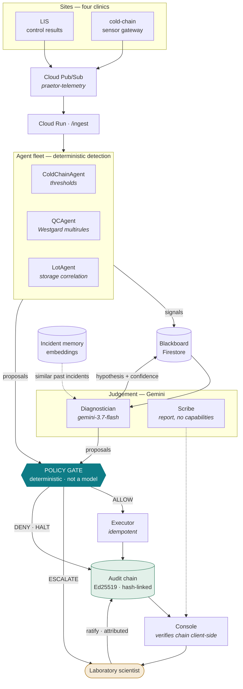

# Praetor

**A policy-gated control plane for a fleet of autonomous agents running a rural clinic laboratory network.**

The reasoning is probabilistic. The permissions are not.

Praetor watches quality control, cold-chain telemetry and reagent lot performance across four
clinic sites on behalf of one medical laboratory scientist. It holds batches, quarantines
reagents and pulls drifting analysers on its own. It can never release a patient result without
a human, however confident it is.

> **Submission:** All Things Agentic Hackathon · track **The Fortified Enterprise Fleet**
> **Live console:** https://praetor-519854598879.us-central1.run.app · **Source:** https://github.com/G-ojies/praetor

---

## The problem

A medical laboratory scientist covering four rural clinics is simultaneously the QC officer, the
inventory manager, the cold-chain custodian and the IT department. The failure that motivates
this system is not dramatic:

A refrigerator compressor degrades overnight. The reagent stored inside slowly loses potency.
Control results drift downward — staying inside two standard deviations for roughly forty hours,
which is to say **staying invisible to anyone reading a Levey-Jennings chart**. By the time
Westgard multirules reject, a day and a half of patient results have gone out on a reagent that
was already wrong.

Nobody was negligent. The signal was real, distributed across three systems that do not talk to
each other, and too slow for a person with four sites to cover to notice.

## What it does about it

Five agents, each with one specialism, coordinating through a shared blackboard.

| Agent | Detects | May act on |
|---|---|---|
| `ColdChainAgent` | sustained temperature excursion | storage units, alerting |
| `QCAgent` | Westgard multirule violations | control runs, patient batches, analysers |
| `LotAgent` | storage/excursion correlation | reagent quarantine, reordering |
| `Diagnostician` | *(reasons — does not detect)* | may request a release |
| `Scribe` | *(writes the report)* | **nothing at all** |

In the scenario above, the fleet quarantines the affected reagent **at hour 32** — a full day
before QC produces a single rejection — because the cold chain is a leading indicator and
quarantine fails closed.

### The judgement that matters

Two reagent lots reject on the same analyser. A naive system counts distinct lots, concludes the
instrument is at fault, and takes a rural clinic's **only analyser** out of service.

Both lots were in the same failed fridge. The common factor is the refrigerator, not the
instrument. Praetor sets aside lots whose storage unit is under an active excursion and
implicates the analyser only by rejections nothing else explains. The instrument stays in
service, correctly, and there is a test named after it.

---

## The policy gate

Every action any agent proposes passes through one deterministic component that is **not a
language model**. It yields exactly one verdict, in this order:

```
0. HALT      circuit breaker tripped for this incident
1. DENY      action outside the closed catalogue
2. DENY      malformed parameters
3. DENY      no capability grant for (agent, action, resource)
4. ESCALATE  action loosens the safety posture
5. ESCALATE  incident more severe than the grant's autonomous ceiling
6. ESCALATE  action is irreversible
7. ESCALATE  diagnostic confidence below the floor
8. ESCALATE  blast-radius budget exhausted
9. ALLOW
```

**Check 4 is the design.** Every action carries a safety direction:

| | Actions | May the fleet act alone? |
|---|---|---|
| **tightens** (fails closed) | hold batch, quarantine lot, take analyser offline, flag run, cold-chain setpoint | **yes** |
| **neutral** | observe, notify, schedule recalibration, reorder | yes |
| **loosens** (fails open) | release batch, clear quarantine, return instrument to service | **never** |

The fleet may move the laboratory toward safety unattended and never away from it, because
releasing a patient result you should not have released is not an incident you can undo.
A test asserts the strong form: *no* combination of capability, severity, budget or confidence
lets any fail-open action reach `ALLOW`.

`DENY` means "never, re-plan". `ESCALATE` means "plausibly right, but not yours to decide alone."
That distinction is what lets the fleet stay autonomous on the routine 90% without ever silently
crossing a line that matters.

### Other brakes

- **Capability grants** — per agent, per action, per resource pattern, with a ceiling on the
  incident severity at which the holder may act autonomously. Readable in one file:
  [`praetor/policy_config.py`](praetor/policy_config.py).
- **Blast-radius budget** — a token bucket per resource. A confidently wrong model runs out of
  budget before it runs out of ideas.
- **Circuit breaker** — after repeated *remediating* actions that do not resolve an incident, the
  fleet stands down. Bookkeeping still passes: standing down means it stops trying to fix things,
  not that it goes silent on the scientist who now has to handle it.

---

## The audit chain

Every decision — including every denial — is appended to a hash-chained, Ed25519-signed log in
Firestore. Editing entry *n* invalidates every hash from *n* onward.

The console verifies the chain **in the browser**, from the public key alone. It is a reader, not
a trustee: nothing it needs would let it forge history.

Appends are transactional. A hash chain is serial by construction, so the head document is a
contention point by design; threads serialise in-process first and cross-container contention
retries with backoff. If an append cannot commit, the gate **raises rather than proceeding** —
refusing to act on a decision it could not record.

---

## Architecture



The separation the diagram encodes: **detection is deterministic, judgement is the model's, and
permission is neither.** Westgard rules, temperature thresholds and lot expiry have correct
answers, so no model is asked — one that hallucinates a `2-2s` violation is worse than no
automation, because it spends the scientist's trust on noise. Correlating four signals into a
root cause has no rule, which is exactly why it is worth a Gemini call. And the gate that decides
what may happen is deterministic, so you can reason about what the fleet is permitted to do
without reasoning about what a model might say.

The frontier model is called **once** across 735 events. There is a test asserting that, because
if it ever climbs, a clinic's cloud bill climbs with it.

---

## Quick start — no credentials required

The full five-day scenario runs offline against a deterministic reasoner:

```bash
git clone <this repo> && cd praetor
python3 -m venv .venv
./.venv/bin/pip install -r requirements.txt
./.venv/bin/python scripts/demo.py
```

You will see the fleet detect the excursion, quarantine both affected lots, hold patient batches,
**leave the analyser in service**, escalate every release request to a human, and sign a
verifiable audit chain.

Run the tests:

```bash
./.venv/bin/python -m pytest tests/ -q      # 98 tests
```

---

## Running against real Gemini

```bash
export GOOGLE_CLOUD_PROJECT=<your-project>
export GOOGLE_GENAI_USE_VERTEXAI=true
export GOOGLE_CLOUD_LOCATION=global
export PRAETOR_OFFLINE=0
gcloud auth application-default login
./.venv/bin/python scripts/demo.py
```

> **Endpoint note, learned the hard way.** Vertex splits its catalogue in a way the docs do not
> state: Gemini **text** models serve from `global` and 404 in every region, while Veo and Lyria
> are the reverse — regional, and absent from `global`. One client cannot address both, so
> Praetor builds them separately. See [`praetor/reasoning.py`](praetor/reasoning.py).

---

## Deploying to Google Cloud

```bash
PROJECT=<your-project>

gcloud services enable \
  aiplatform.googleapis.com run.googleapis.com firestore.googleapis.com \
  pubsub.googleapis.com cloudbuild.googleapis.com artifactregistry.googleapis.com \
  secretmanager.googleapis.com texttospeech.googleapis.com --project $PROJECT

gcloud firestore databases create --location=us-central1 --project $PROJECT

# Signing key for the audit chain. Generated locally, uploaded, shredded.
./scripts/create_signing_key.sh $PROJECT

# Runtime identity — least privilege, secret access scoped to the one secret.
gcloud iam service-accounts create praetor-run --project $PROJECT
for R in roles/datastore.user roles/aiplatform.user roles/pubsub.subscriber; do
  gcloud projects add-iam-policy-binding $PROJECT \
    --member="serviceAccount:praetor-run@$PROJECT.iam.gserviceaccount.com" --role="$R"
done
gcloud secrets add-iam-policy-binding praetor-audit-key \
  --member="serviceAccount:praetor-run@$PROJECT.iam.gserviceaccount.com" \
  --role=roles/secretmanager.secretAccessor --project $PROJECT

gcloud run deploy praetor --source . --region us-central1 --project $PROJECT \
  --service-account praetor-run@$PROJECT.iam.gserviceaccount.com \
  --no-allow-unauthenticated --min-instances 0 --max-instances 1 \
  --set-env-vars "GOOGLE_CLOUD_PROJECT=$PROJECT,GOOGLE_GENAI_USE_VERTEXAI=true,GOOGLE_CLOUD_LOCATION=global,PRAETOR_OFFLINE=0,PRAETOR_NAMESPACE=live"
```

Replay the scenario into the deployment:

```bash
TOKEN=$(gcloud auth print-identity-token)
./.venv/bin/python scripts/feed.py "$(gcloud run services describe praetor \
  --region us-central1 --format='value(status.url)')" --hours 60 --token "$TOKEN"
```

### Bursts

The ingest path is paced, not throttled by the service. A single instance cannot
absorb several hundred Pub/Sub pushes at once — Cloud Run rejects them with *no
available instance*, Pub/Sub retries, and the replay takes longer than if it had
been slowed down in the first place. `scripts/publish.py` therefore paces itself
(`--rate`, default 12/s). A clinic produces a reading a minute; only the replay
harness ever produces six hundred at once.

### Why one instance

The audit chain is durable and transactional. The blackboard is durable but **not** concurrent —
two containers would restore two copies and diverge. One container with correct state beats three
with divergent state, and a clinic fleet's decision rate is nowhere near needing horizontal
scale. The gate's guarantees do not depend on either choice. This is written up in
[`service/main.py`](service/main.py) rather than left to be discovered.

---

## Required technology

| Requirement | Where |
|---|---|
| **Gemini 3.5 or newer** | `gemini-3.7-flash` (diagnostician, scribe), `gemini-3.5-flash-lite` (triage tier) — [`praetor/reasoning.py`](praetor/reasoning.py) |
| **Google agent framework** | Google GenAI SDK (`google-genai`), with `google-adk` in the runtime image |
| **Google Cloud infrastructure** | Cloud Run, Firestore, Pub/Sub, Secret Manager |

### Additional Google models

Each chosen from who has to act, not from a bonus list.

| Model | Why it is here |
|---|---|
| **Gemini 3 Pro Image** | The person at the failed fridge at 06:00 is whoever opened the clinic, not the scientist. Written steps assume laboratory training; an illustrated card does not. The measured peak temperature is passed in — an illustration carrying an invented number is worse than none. |
| **Lyria** | At the bench, hands are gloved and eyes are down a microscope. Audio is the only channel left, so severity gets a distinct motif rather than one undifferentiated beep. |
| **Chirp 3 HD** | The hero drives between four sites. A handover that must be read is read at the wheel, or not at all. |
| **Embeddings** | Incident memory. What a lab knows usually lives in whoever was on shift and leaves when they do. |

**Veo is not integrated.** It is inaccessible on this project at every published version and
needs allowlisting. Rather than claim an integration that does not run, the need it covered —
a handover consumable without hands or eyes — is met by speech.

---

## Cost

Built to run on a clinic's budget, not a demo budget.

- The frontier model is called once per incident, not once per event.
- High-volume cold-chain telemetry is triaged by Flash-Lite, roughly an order of magnitude
  cheaper per token.
- Cloud Run scales to zero.
- Incident memory is a linear scan over a few hundred vectors — no vector index, no dedicated
  cluster. A four-site network produces a few hundred incidents a year; the index would cost more
  than the scan.
- Media generation is explicit and cached. Nothing generates a video or an image on an event.

---

## Access

The console is **public and needs no credentials**: https://praetor-519854598879.us-central1.run.app

It is not open, though. Going public turns every endpoint into a cost surface, so three tiers
guard it ([`service/guard.py`](service/guard.py)):

| Endpoint | Limit | Why |
|---|---|---|
| `/ingest` | **never public** | runs the fleet and can invoke Gemini. Verifies the Google-signed OIDC token itself and requires the push service account — a signed token is not enough, since any Google account can mint one |
| `/api/media/*`, `/api/memory` | 6 per hour per client | each call invokes a paid model |
| everything else | 120 per minute per client | reads, bounded so a loop cannot bury the service |

The buckets are in-process, which suits a single-instance deployment and would need Redis if that
changed.

The repository is public, so `testing@devpost.com` and `cloudhackathons@google.com` need no grant.

---

## Layout

```
praetor/
  common/types.py        closed action catalogue — 14 typed actions, each with a safety direction
  gate/
    capabilities.py      per-agent, per-resource grants
    budget.py            blast-radius token bucket + circuit breaker
    audit.py             hash chain, Ed25519 signing, verification
    firestore_audit.py   durable, transactional chain
    policy.py            the gate
  agents/                cold chain, QC, lots, diagnostician, scribe
  sim/
    westgard.py          the standard 6-rule multirule set
    lab.py               five-day, four-clinic scenario with modelled fault coupling
  memory.py              incident recall via embeddings
  media.py               image, audio, speech
  state.py               durable blackboard
  reasoning.py           two-tier model seam + offline implementation
  orchestrator.py        the fleet loop
service/                 Cloud Run app + console
tests/                   98 tests
```

## Tests worth reading

They are named after the properties they defend:

- `test_no_fail_open_action_is_reachable_by_any_grant`
- `test_the_analyser_is_never_taken_out_of_service`
- `test_quarantine_lands_a_full_day_before_qc_ever_rejects`
- `test_the_control_lot_in_the_healthy_fridge_never_rejects`
- `test_10x_catches_drift_that_never_leaves_1s`
- `test_altering_a_logged_decision_breaks_verification`
- `test_bookkeeping_still_passes_once_the_fleet_has_stood_down`
- `test_the_blackboard_cannot_outgrow_a_firestore_document`
- `test_javascript_canonicalisation_matches_python_byte_for_byte`
- `test_an_unrelated_query_recalls_nothing`

## Licence

MIT. Built for the All Things Agentic Hackathon, August 2026.
